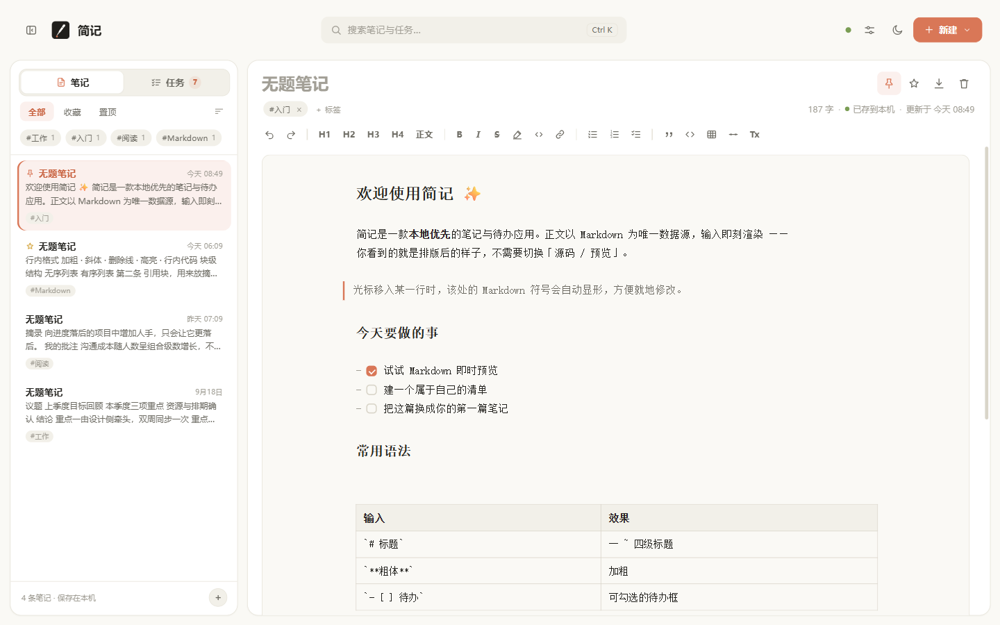
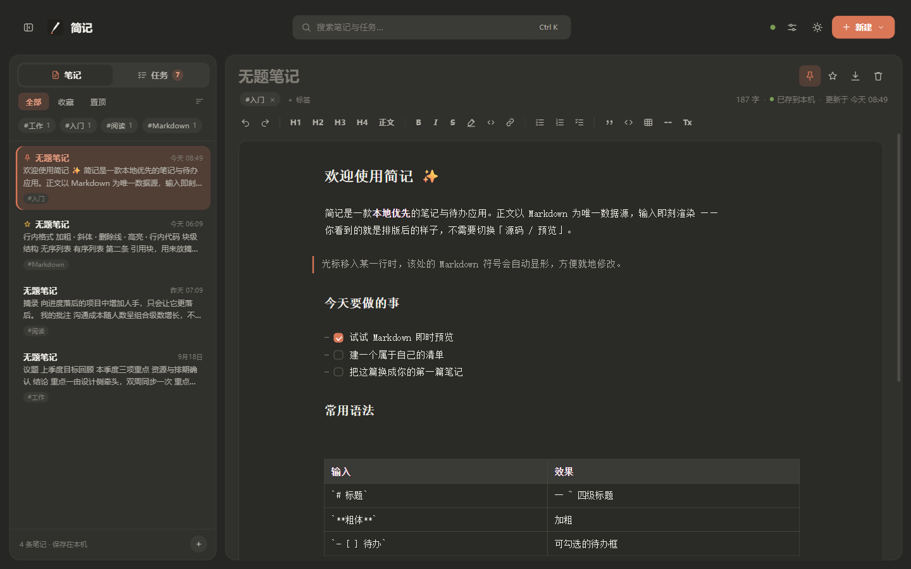
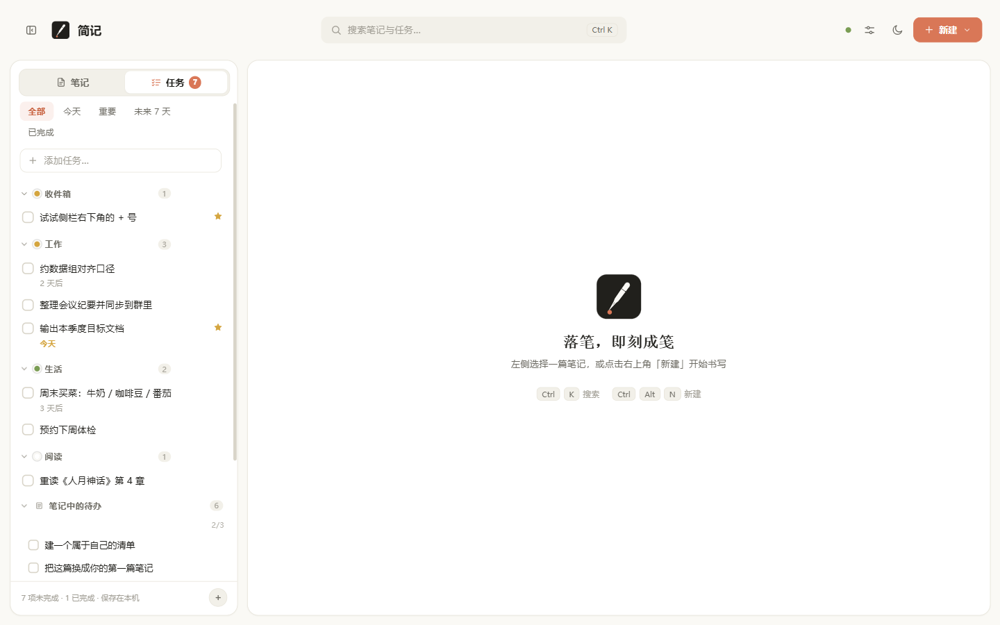
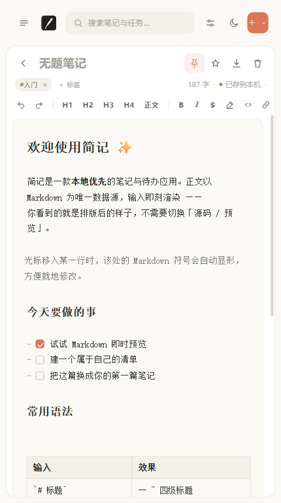

<p align="center">
  
</p>

<h1 align="center">简记 · Jianji</h1>

<p align="center">
  <strong>本地优先的 Markdown 笔记 + 清单待办，一套代码，Web 与桌面双形态。</strong>
</p>

<p align="center">
  
  
  
  
  
</p>

---

简记是一款简洁风格的笔记与待办应用。正文以 **Markdown 为唯一数据源**，边写边渲染——你看到的就是排版后的样子，不需要切换「源码 / 预览」。后端是一个**零依赖**的 Node 单文件服务，笔记存本地 JSON，可选同步到 **S3 或 WebDAV**。

它同时是一个 Web 应用和一个 Electron 桌面应用：同一套前端、同一个后端，没有两套逻辑。

| 浅色 | 深色 |
| --- | --- |
|  |  |

| 待办视图 | 移动端 |
| --- | --- |
|  |  |

## ✨ 特性

**编辑**

- **Markdown 即时预览**：语法符号由 CodeMirror 6 Decoration 隐藏/替换，光标进入节点时源码自动显形，就地修改
- 支持标题、引用、列表、任务勾选框、表格、代码块、分割线、加粗 / 斜体 / 删除线 / 高亮 / 行内代码
- 自动保存、导出 Markdown、旧版 HTML 笔记自动迁移

**整理**

- 双模式：笔记 / 待办，共用同一套编辑内核与存储
- 全文搜索（同时搜笔记与任务）、置顶、收藏、标签筛选、三种排序
- 删除后可撤销（提示 3 秒消失，带所属分类）

**待办**

- 清单分组（默认「收件箱」，可建多个，支持换色 / 折叠 / 重命名）
- 截止日、三档优先级、重要标记、Markdown 备注
- **待办聚合**：自动汇总所有笔记正文里的 `- [ ]` 项，勾选即回写原笔记，点击直达出处
- 筛选：全部 / 今天 / 重要 / 未来 7 天 / 已完成

**形态**

- **桌面应用**：Electron 内嵌同一后端（随机端口 + 仅本机回环），数据存系统用户目录
- **系统托盘**：图标随系统主题深浅自动切换，右键菜单可显隐窗口 / 新建笔记
- **Web 服务**：起一个 Node 进程即可，局域网或本机访问

**同步**

- S3（AWS SigV4 直连，兼容一切 SigV4 服务）或 WebDAV（坚果云 / Nextcloud / 群晖）
- 笔记 + 任务 + 清单整体存档，**条目级合并**多端变更
- 「从云端恢复」作为误删的逃生通道

## 🚀 快速开始

### 桌面应用（Electron）

不想从源码构建？直接从 [Releases](https://github.com/myyyisbest/jianji/releases/latest) 下载：

- **Windows**：安装包或便携版（约 88 MB，x64）
- **macOS**：`.dmg` 或 `.zip`，Apple Silicon（`arm64`）与 Intel（`x64`）各一份

```bash
npm install     # 首次：安装 electron / esbuild
npm start       # 启动桌面窗口
```

数据存于系统用户数据目录（Windows 为 `%APPDATA%/简记/data`，
macOS 为 `~/Library/Application Support/简记/data`），与应用代码分离。

> **macOS 首次打开提示「已损坏 / 无法验证开发者」**
> 当前 Mac 包<b>未签名、未公证</b>（Apple 开发者账号年费 99 美元，暂未办理）。
> 这不是文件坏了，是 Gatekeeper 拦的。二选一：
>
> ```bash
> # 方式一（推荐）：去掉下载时打上的隔离属性
> xattr -cr /Applications/简记.app
> ```
>
> 方式二：在访达里**右键**点 `简记.app` → 「打开」，弹窗里再点一次「打开」。
> 直接双击是不行的。只需做一次，之后正常启动。

打包独立可执行文件：

```bash
npm run dist        # 产物在 dist/，按当前平台打包
npm run dist:mac    # 打 Mac 包（arm64 + x64），只能在 macOS 上运行
```

> Windows 上执行 `npm run dist:mac` 会直接失败：
> `Build for macOS is supported only on macOS`。这是 electron-builder 的硬限制，
> Mac 包请在 Mac 上打，或用仓库里的 `release.yml` 交给 GitHub Actions。

| 产物 | 说明 |
| --- | --- |
| `jianji-<version>-setup.exe` | NSIS 安装程序，可选安装目录、建桌面 / 开始菜单快捷方式 |
| `jianji-<version>-portable.exe` | 免安装单文件，双击即用 |
| `jianji-<version>-mac-arm64.dmg` | macOS 磁盘映像，Apple Silicon（M1 及以后） |
| `jianji-<version>-mac-x64.dmg` | macOS 磁盘映像，Intel 芯片 |
| `jianji-<version>-mac-<arch>.zip` | 免安装压缩包，解压后拖进「应用程序」即可 |

### Web 服务

```bash
npm run web     # 等价于 node server.js
# 默认 http://localhost:8642，PORT / HOST 环境变量可改
```

Web 模式**运行时零依赖**：编辑器内核已预打包在 `vendor/cm6.js`，clone 下来直接起服务即可。

> 也可以不启后端、直接双击 `index.html`，此时数据仅保存在浏览器 localStorage（界面会提示「后端未连接」）。

## ⌨️ 快捷键

| 快捷键 | 作用 |
| --- | --- |
| `Ctrl/⌘ K` | 聚焦搜索（同时搜笔记与任务） |
| `Ctrl/⌘ Alt N` | 新建笔记 |
| `Ctrl/⌘ Alt T` | 新建任务 |
| `Ctrl/⌘ S` | 立即保存 |
| `Ctrl/⌘ B` / `I` | 加粗 / 斜体 |
| `Esc` | 关闭弹窗 · 清空搜索 |

## ☁️ 云端同步

1. 启动后端，点击顶栏「设置」，在 S3 / WebDAV 间任选其一（两种配置可分别留存）
2. **S3**：填 Endpoint / Region / Bucket / Access Key / Secret
   **WebDAV**：填地址 / 用户名 / 应用密码 / 存档路径
3. 开启「保存即上传」：每次保存自动推送；「从云端合并」按条目级合并多端变更（较新修改胜出，删除同步传播）

- 存档内容为整体：`{notes, tasks, lists, settings, deleted, savedAt}`
- S3 存档对象默认 `notes.json`；WebDAV 存档路径默认 `/notes.json`
- 数据链路：浏览器 / 桌面端 → `data/notes.json` → 你的 S3 桶或 WebDAV 目录

不接真实云服务也能自测整条链路：

```bash
node scripts/mock-s3.js       # Mock S3（:9121，不做签名校验）
node scripts/mock-webdav.js   # Mock WebDAV（:9700，Basic Auth）
```

> **删除是永久且粘性的**——这是墓碑机制的设计必然结果（详见 [docs/SYNC.md](docs/SYNC.md)）。误删请用设置面板的「从云端恢复」。

## 📁 目录结构

```
├── index.html              # 页面结构
├── css/style.css           # 简洁风格设计系统（双主题）
├── js/
│   ├── app.js              # 前端逻辑（渲染 / 任务 / 同步设置 / 桌面桥接）
│   └── markdown.js         # 零依赖 MD→HTML 渲染器
├── build/cm6-entry.js      # 编辑器内核源码（即时预览扩展、GFM 解析、快捷键）
├── vendor/cm6.js           # 上述源码的 esbuild 产物，运行时直接用（入库以便 clone 即跑）
├── electron/
│   ├── main.js             # 主进程（应用名 / 单实例锁 / 内嵌后端 / 窗口 / 托盘）
│   └── preload.js          # 预加载脚本（contextBridge 白名单）
├── server.js               # 零依赖 Node 后端（静态服务 + API + S3 SigV4 + WebDAV）
├── scripts/                # 启动脚本、mock 服务、图标生成、回归用例
├── icon/                   # 应用图标与托盘图标（由 scripts/make-icon.py 生成）
├── docs/                   # 架构、开发、同步、安全文档
├── dist/                   # 打包产物（gitignore）
└── data/                   # 运行时生成：notes.json、s3-config.json（gitignore）
```

## 🛠 技术栈

| 层 | 选型 |
| --- | --- |
| 编辑器 | CodeMirror 6 + @lezer/markdown（含 GFM），esbuild 打包为单文件 |
| 前端 | 原生 JS，无框架、无构建步骤（改完刷新即生效） |
| 后端 | Node 原生 `http` 模块，零第三方依赖 |
| 桌面 | Electron（内嵌后端 + preload/IPC） |
| 测试 | Playwright + 系统 Edge，四组端到端回归（91 项） |

## 🔒 安全

后端是**零鉴权**的，所以暴露面被收到最小：默认只监听 `127.0.0.1`、请求体有大小上限、存档原子写入且损坏自动回退、静态路径用 `path.relative` 判越界、页面带 CSP、Electron 导航锁死。

完整说明见 [docs/SECURITY.md](docs/SECURITY.md)。

> 同步密钥以明文存在服务器 `data/s3-config.json`。`data/` 已被 gitignore，**请勿将其提交到仓库**。

## 📚 文档

| 文档 | 内容 |
| --- | --- |
| [docs/ARCHITECTURE.md](docs/ARCHITECTURE.md) | 整体架构、Web / 桌面双形态、两条桌面通道、Markdown 编辑器实现 |
| [docs/DEVELOPMENT.md](docs/DEVELOPMENT.md) | 开发环境、npm 脚本、回归测试、视觉约定与踩坑记录 |
| [docs/SYNC.md](docs/SYNC.md) | 云同步语义、条目级合并、墓碑机制、启动顺序、API |
| [docs/SECURITY.md](docs/SECURITY.md) | 安全模型与已知取舍 |
| [docs/CI-CD.md](docs/CI-CD.md) | CI/CD 流水线设计、触发矩阵、分支保护等人工配置 |
| [CHANGELOG.md](CHANGELOG.md) | 版本记录 |
| [CONTRIBUTING.md](CONTRIBUTING.md) | 贡献指南 |

## 🤝 贡献

欢迎 Issue 与 PR。提交前请跑一遍回归测试，并阅读 [CONTRIBUTING.md](CONTRIBUTING.md)。

## 📄 许可证

[MIT](LICENSE) © 2026 wuxujia
